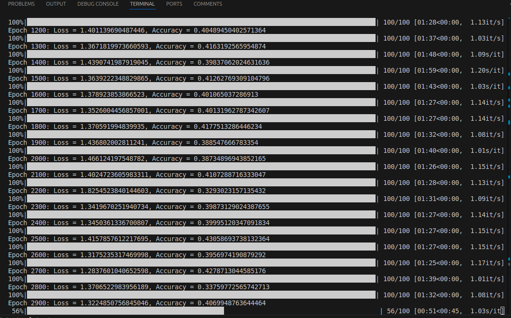
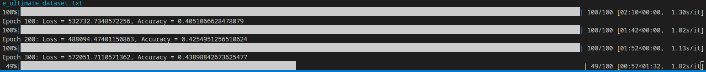
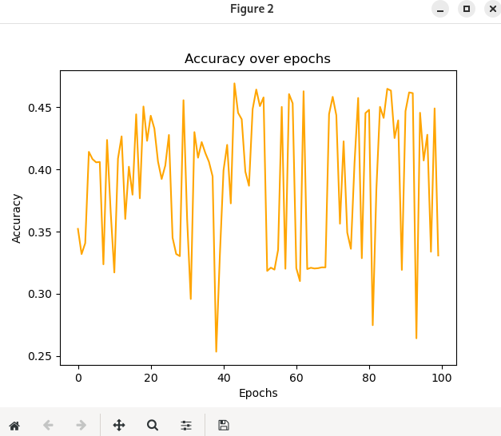
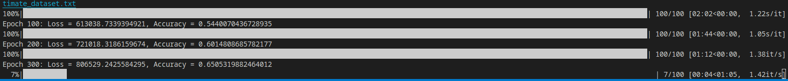
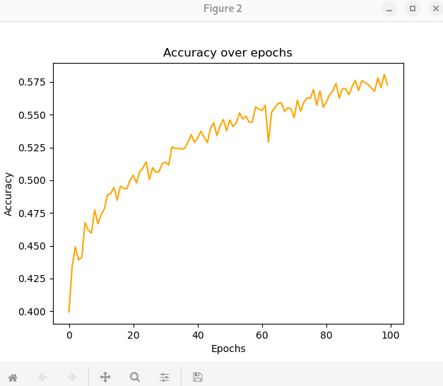
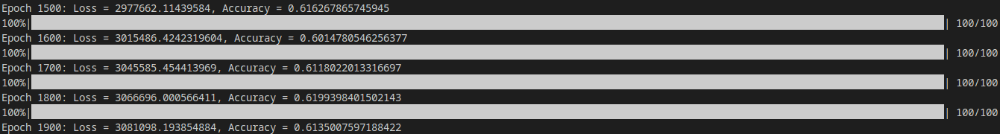

## Benchmark Documentation

### Initial Setup
We started with a basic neural network and implemented Kaiming initialization and the ReLU activation function. The network consisted of 2 hidden layers with 18 neurons each. However, the results were disappointing, achieving only about 40% accuracy.

### Batch Input System and Layer Adjustment
Next, we added a batch input system and modified the hidden layers to have 128 neurons in the first layer and 256 neurons in the second layer. We set the learning rate to 1, but the results were too random and the accuracy stagnated.

### Accuracy Evolution Over 100 Epochs
To visualize the randomness of the results, we plotted the accuracy over 100 epochs.

### Learning Rate Adjustment
Finally, we adjusted the learning rate to 0.1, which significantly improved the results.

### Accuracy Evolution Over 100 Epochs
To visualize the improvement in accuracy over time, we plotted the accuracy over 100 epochs.

### Learning Rate Adjustment to 0.01
We also experimented with a learning rate of 0.01, but the results were not as good as with a learning rate of 0.1.

